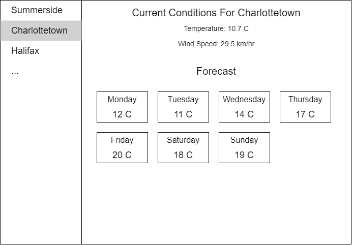

# Front End Challenge

This application displays weather data for a number of cities, but some features are missing or incomplete.
Follow the instructions below to finish the app.

## Outcomes

To test your skills with Angular and RxJs. Refrain from using promises.

## Prerequisites
 - git
 - node - v14.15
 - global angular cli - v12.2

## Instructions
Complete the sections below and ensure that all unit tests pass. 
Follow the pre-existing code patterns.   
You may modify the code however you wish, but do not modify `src/api/api-service.ts`. 

### 1. Fix the Current Conditions Section
The current conditions section only displays one static set of data when it loads.
However, the API provides updated conditions on every request.   
Modify the code to display updated weather data every second.

### 2. Implement the Forecast Section
There should be a 7-day forecast below the current conditions, seen in the following mockup:

You can retrieve the forecast data from the `api/forecasts` endpoint.

Implement the forecast section from scratch to match the mockup.   
Only load the forecast once per city.    
Use Angular Material for the UI.

### 3. Add one new feature of your choice, or improve upon an existing one.
